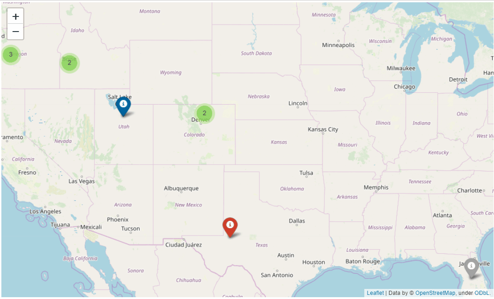

# Module 4 -  Final Project Submission

## Introduction

In this project, I use SARIMA modeling to determine the best zip codes to invest in.

## Objectives

* Given a raw data set, predict which zip codes will have the best rate of return over the next 5 years.

### Final Project Summary

A

### The Project

F

## The Deliverables

T

### Jupyter Notebook Must-Haves

F

#### Organization/Code Cleanliness

The notebook should be well organized, easy to follow, and code is modularized and commented where appropriate.

* Level Up: The notebook contains well-formatted, professional looking markdown cells explaining any substantial code. All functions have docstrings that act as professional-quality documentation.
* The notebook is written to technical audiences with a way to both understand your approach and reproduce your results. The target audience for this deliverable is other data scientists looking to validate your findings.
* Data visualizations you create should be clearly labeled and contextualized--that is, they fit with the surrounding code or problems you're trying to solve. No dropping data visualizations randomly around your notebook without any context!

#### Findings

Y

#### Visualizations

Time-Series Analysis is an area of data science that lends itself well to intuitive data visualizations. Whereas we may not be able to visualize the best choice in a classification or clustering problem with a high-dimensional dataset, that isn't an issue with Time Series data. As such, **_any findings worth mentioning in this problem are probably also worth visualizing_**. Your notebook should make use of data visualizations as appropriate to make your findings obvious to any readers.

Also, remember that if a visualization is worth creating, then it's also worth taking the extra few minutes to make sure that it is easily understandable and well-formatted. When creating visualizations, make sure that they have:

* A title
* Clearly labeled X and Y axes, with appropriate scale for each
* A legend, when necessary
* No overlapping text that makes it hard to read
* An intelligent use of color--multiple lines should have different colors and/or symbols to make them easily differentiable to the eye
* An appropriate amount of information--avoid creating graphs that are "too busy"--for instance, don't create a line graph with 25 different lines on it

There's just too much going on in this graph for it to be readable--don't make the same mistake! (<a href='http://genywealth.com/wp-content/uploads/2010/03/line-graph.php_.png'>Source</a>)

### Blog Post Must-Haves

Refer back to the [Blogging Guidelines](https://github.com/learn-co-curriculum/dsc-welcome-blogging) for the technical requirements and blog ideas.

### Executive Summary Must-Haves

Your presentation should:

Contain between 5-10 professional quality slides detailing:

* A high-level overview of your methodology and findings, including the 5 zipcodes you recommend investing in
* A brief explanation of what metrics you defined as "best" in order complete this project

As always, this prresentation should also:

* Take no more than 5 minutes to present
* Avoid technical jargon and explain results in a clear, actionable way for non-technical audiences.

